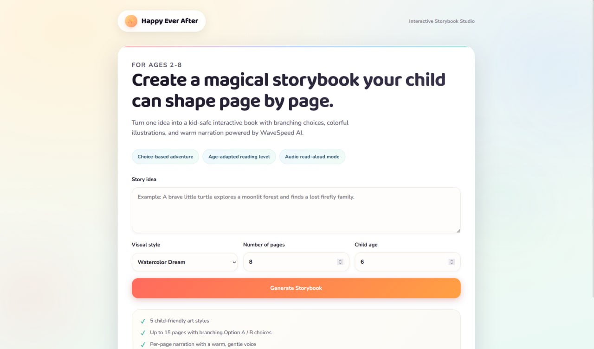

# 📖 Happy Ever – AI Storybook Generator

https://happyeverafter.zeabur.app/

An AI-powered storybook application that generates personalized children's stories with engaging narratives and visual elements. The app leverages Generative AI to create creative, interactive, and educational story experiences.

---

## 🚀 Project Overview

**Happy Ever** is a storybook AI application designed to:

* Generate customized children’s stories
* Create engaging narratives based on user prompts
* Support AI-generated visuals for storytelling
* Provide a fun and interactive reading experience

This project demonstrates the integration of Generative AI models into a user-friendly application.

---

## 🎯 Problem Statement

Children’s story creation can be time-consuming and requires creativity. This project aims to:

* Automate story generation using AI
* Personalize stories based on user input
* Enhance engagement through visuals and structured storytelling

---

## 👥 Target Users

* Parents creating bedtime stories
* Teachers generating educational content
* Children exploring creative storytelling
* Anyone interested in AI-generated stories

---

## 🧠 Technologies Used

* **Frontend**: (e.g., React / HTML / CSS / Antigravity)
* **Backend**: (e.g., Node.js / Python)
* **AI Models**:

  * ChatGPT (story generation)
  * Image generation model (illustrations)
* **APIs**: OpenAI API / Other AI APIs
* **Deployment**: (e.g., Vercel / GitHub Pages / Render)

---

## ⚙️ Features

* ✨ AI-generated story content
* 🎨 Optional AI-generated illustrations
* 🧒 Customizable characters and themes
* 📚 Structured story format (beginning, middle, end)
* 🖼️ Interactive visual elements

---

## 🏗️ System Architecture

1. User enters story prompt
2. Prompt is processed by AI model
3. AI generates story text
4. (Optional) Image model generates illustrations
5. Results displayed in user interface

---

## 📦 Installation

```bash
# Clone the repository
git clone https://github.com/your-username/happy-ever.git

# Navigate into project folder
cd happy-ever

# Install dependencies
npm install

# Run the application
npm start
